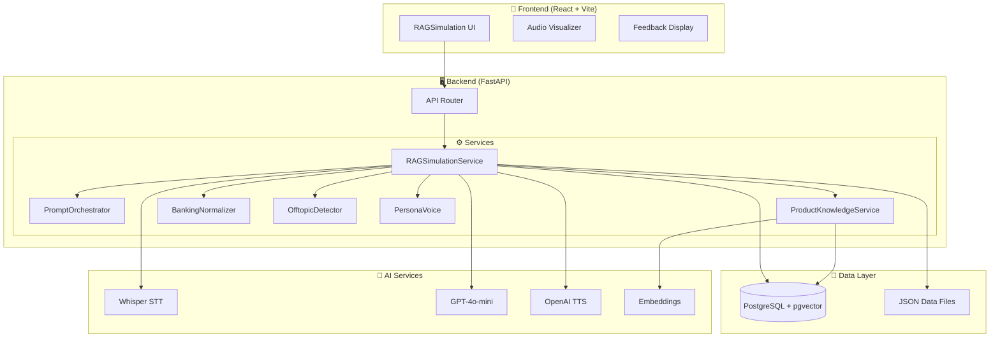
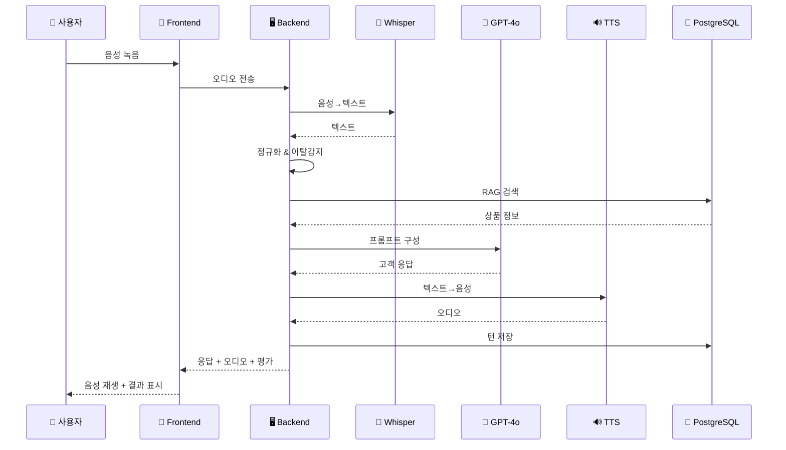

# 🏦 은행 신입사원 온보딩 시뮬레이션 모듈 아키텍처

## 📋 목차
1. [시스템 개요](#1-시스템-개요)
2. [전체 아키텍처 다이어그램](#2-전체-아키텍처-다이어그램)
3. [핵심 컴포넌트 상세](#3-핵심-컴포넌트-상세)
4. [데이터 흐름](#4-데이터-흐름)
5. [평가 시스템](#5-평가-시스템)
6. [기술 스택](#6-기술-스택)

---

## 1. 시스템 개요

### 1.1 프로젝트 목표
은행 신입사원이 **AI 가상 고객과 실제 은행 상담 시뮬레이션**을 통해 업무 역량을 향상시킬 수 있는 교육 플랫폼

### 1.2 주요 기능
| 기능 | 설명 |
|------|------|
| 🎤 **음성 상담 시뮬레이션** | STT/TTS 기반 실시간 음성 대화 |
| 🤖 **AI 가상 고객** | 다양한 페르소나(성격, 연령, 직업)를 가진 가상 고객 |
| 📊 **실시간 평가** | 5가지 역량 지표 기반 즉각적 피드백 |
| 📚 **RAG 지식 검증** | 상품 정보 정확성 자동 검증 |
| 🎯 **목표 달성 추적** | 상담 목표 달성률 실시간 모니터링 |

### 1.3 지원 업무 카테고리
```
┌─────────────┬─────────────┬─────────────┬─────────────┐
│   💰 수신    │   💳 여신    │   💎 카드    │   🌍 외환    │
├─────────────┼─────────────┼─────────────┼─────────────┤
│ • 정기예금   │ • 주택담보   │ • 신용카드   │ • 해외송금   │
│ • 자유적금   │ • 신용대출   │ • 체크카드   │ • 환전      │
│ • 보통예금   │ • 마이너스   │ • 선불카드   │ • 외화예금   │
└─────────────┴─────────────┴─────────────┴─────────────┘
```

---

## 2. 전체 아키텍처 다이어그램

### 2.1 시스템 아키텍처 (전체 구조)

```
┌──────────────────────────────────────────────────────────────────────────────┐
│                              📱 Frontend (React + TypeScript)                 │
│  ┌─────────────────┐  ┌─────────────────┐  ┌─────────────────────────────┐  │
│  │ RAGSimulation   │  │ Audio Visualizer│  │ SimulationFeedback          │  │
│  │ • 페르소나 선택  │  │ • 녹음 상태 표시 │  │ • 5대 역량 차트              │  │
│  │ • 상황 선택     │  │ • 음성 파형     │  │ • 상세 피드백                │  │
│  │ • 대화 인터페이스│  │ • 재생 컨트롤   │  │ • 학습 추천                  │  │
│  └────────┬────────┘  └────────┬────────┘  └─────────────────────────────┘  │
│           │                    │                                             │
│           ▼                    ▼                                             │
│  ┌────────────────────────────────────────────────────────────────────────┐  │
│  │                         🔊 Web Audio API                               │  │
│  │              MediaRecorder (녹음) / Audio (재생)                        │  │
│  └────────────────────────────────────────────────────────────────────────┘  │
└──────────────────────────────────────────────────────────────────────────────┘
                                    │
                                    │ HTTP/REST API
                                    ▼
┌──────────────────────────────────────────────────────────────────────────────┐
│                           🖥️ Backend (FastAPI + Python)                      │
│                                                                              │
│  ┌────────────────────────────────────────────────────────────────────────┐  │
│  │                        📡 API Router Layer                             │  │
│  │  ┌──────────────────────────────────────────────────────────────────┐  │  │
│  │  │                    rag_simulation.py                             │  │  │
│  │  │  • POST /start-simulation        • GET /personas                 │  │  │
│  │  │  • POST /start-test-simulation   • GET /situations               │  │  │
│  │  │  • POST /process-voice-interaction                               │  │  │
│  │  │  • POST /end-simulation          • GET /business-categories      │  │  │
│  │  │  • POST /analyze-goal-achievement                                │  │  │
│  │  └──────────────────────────────────────────────────────────────────┘  │  │
│  └────────────────────────────────────────────────────────────────────────┘  │
│                                    │                                         │
│                                    ▼                                         │
│  ┌────────────────────────────────────────────────────────────────────────┐  │
│  │                       ⚙️ Service Layer                                 │  │
│  │                                                                        │  │
│  │  ┌─────────────────────────────────────────────────────────────────┐  │  │
│  │  │              RAGSimulationService (핵심 오케스트레이터)          │  │  │
│  │  │  • start_voice_simulation()    • process_voice_interaction()    │  │  │
│  │  │  • start_test_simulation()     • end_simulation()               │  │  │
│  │  │  • _speech_to_text()           • _text_to_speech()              │  │  │
│  │  │  • _generate_customer_response()                                │  │  │
│  │  │  • _evaluate_user_response()   • _evaluate_rag_integration()    │  │  │
│  │  └─────────────────────────────────────────────────────────────────┘  │  │
│  │          │                    │                    │                   │  │
│  │          ▼                    ▼                    ▼                   │  │
│  │  ┌──────────────┐  ┌──────────────────┐  ┌─────────────────────────┐  │  │
│  │  │PromptOrch-   │  │Product Knowledge │  │    Banking Services     │  │  │
│  │  │estrator      │  │Service           │  │                         │  │  │
│  │  │• compose_llm │  │• 상품 정보 검색   │  │ • BankingNormalizer     │  │  │
│  │  │  _messages() │  │• 벡터 유사도 검색 │  │ • OfftopicDetector      │  │  │
│  │  │• parse_llm   │  │• 사실 검증       │  │ • PersonaVoice          │  │  │
│  │  │  _response() │  │• 키워드 추출     │  │                         │  │  │
│  │  └──────────────┘  └──────────────────┘  └─────────────────────────┘  │  │
│  │          │                    │                    │                   │  │
│  │          ▼                    ▼                    ▼                   │  │
│  │  ┌────────────────────────────────────────────────────────────────┐   │  │
│  │  │                    External AI Services                        │   │  │
│  │  │  ┌────────────┐  ┌────────────┐  ┌────────────┐  ┌──────────┐ │   │  │
│  │  │  │ 🎤 STT     │  │ 🧠 LLM     │  │ 🔊 TTS     │  │ 📊 Embed │ │   │  │
│  │  │  │ Whisper    │  │ GPT-4o-mini│  │ OpenAI TTS │  │ ada-002  │ │   │  │
│  │  │  └────────────┘  └────────────┘  └────────────┘  └──────────┘ │   │  │
│  │  └────────────────────────────────────────────────────────────────┘   │  │
│  └────────────────────────────────────────────────────────────────────────┘  │
│                                    │                                         │
│                                    ▼                                         │
│  ┌────────────────────────────────────────────────────────────────────────┐  │
│  │                        💾 Data Layer                                   │  │
│  │  ┌────────────────────┐  ┌─────────────────────────────────────────┐  │  │
│  │  │ PostgreSQL+pgvector│  │           JSON Data Files               │  │  │
│  │  │ • rag_simulation   │  │ • personas_expanded_minified2.json      │  │  │
│  │  │   _sessions        │  │ • situations_4categories.txt            │  │  │
│  │  │ • rag_simulation   │  │ • product_catalog.json                  │  │  │
│  │  │   _turns           │  │ • products/*.jsonl (상품 상세)           │  │  │
│  │  │ • rag_simulation   │  │ • banking_domain_dictionary.json        │  │  │
│  │  │   _evaluations     │  │                                         │  │  │
│  │  │ • product_chunks   │  │                                         │  │  │
│  │  │   (벡터 임베딩)     │  │                                         │  │  │
│  │  └────────────────────┘  └─────────────────────────────────────────┘  │  │
│  └────────────────────────────────────────────────────────────────────────┘  │
└──────────────────────────────────────────────────────────────────────────────┘
```

### 2.2 시뮬레이션 흐름 다이어그램

```
┌─────────────────────────────────────────────────────────────────────────┐
│                        🎮 시뮬레이션 진행 흐름                           │
└─────────────────────────────────────────────────────────────────────────┘

     [시작]
        │
        ▼
┌───────────────┐     ┌───────────────┐     ┌───────────────┐
│  1. 설정 단계  │────▶│  2. 상담 단계  │────▶│  3. 평가 단계  │
│               │     │               │     │               │
│ • 페르소나 선택│     │ • 음성 녹음    │     │ • 5대 역량    │
│ • 상황 선택   │     │ • STT 변환     │     │   점수 계산   │
│ • 세션 생성   │     │ • AI 응답 생성 │     │ • 피드백 생성 │
│               │     │ • TTS 재생     │     │ • DB 저장     │
└───────────────┘     │ • 실시간 평가  │     └───────────────┘
                      │ • 목표 추적    │
                      └───────────────┘
                             │
                      ┌──────┴──────┐
                      ▼             ▼
               ┌─────────────┐ ┌─────────────┐
               │  계속 상담   │ │  상담 종료   │
               │  (반복)     │ │  (평가로)   │
               └─────────────┘ └─────────────┘
```

---

## 3. 핵심 컴포넌트 상세

### 3.1 RAGSimulationService (핵심 서비스)

```python
class RAGSimulationService:
    """
    시뮬레이션 전체 흐름을 관장하는 핵심 오케스트레이터
    """
    
    # 주요 메서드
    ├── start_voice_simulation()     # 시뮬레이션 세션 시작
    ├── start_test_simulation()      # 테스트 모드 시작
    ├── process_voice_interaction()  # 음성 상호작용 처리
    ├── end_simulation()             # 시뮬레이션 종료 및 평가
    │
    # 내부 처리 메서드
    ├── _speech_to_text()            # OpenAI Whisper STT
    ├── _text_to_speech()            # OpenAI TTS
    ├── _generate_customer_response() # LLM 기반 고객 응답 생성
    ├── _evaluate_user_response()    # 발화 품질 평가
    ├── _evaluate_rag_integration()  # RAG 지식 정확성 검증
    └── _detect_conversation_end()   # 대화 종료 감지
```

### 3.2 PromptOrchestrator (프롬프트 관리)

```python
# AI 고객 역할 프롬프트 핵심 구조

┌──────────────────────────────────────────────────────┐
│                🎭 System Prompt                      │
├──────────────────────────────────────────────────────┤
│ 1. 고객 역할 가이드                                   │
│    • 절대 직원처럼 대답하지 않음                       │
│    • 자연스러운 고객 말투 사용                         │
│                                                      │
│ 2. 페르소나별 말투                                    │
│    • 😡 불만형: "왜 이렇게 오래 걸려요?"               │
│    • 😰 급함형: "지금 바로 가능할까요?"                │
│    • 😊 긍정형: "좋네요! 감사합니다!"                  │
│    • 😔 불안형: "이거 손해보는 건 아니죠?"             │
│    • 😏 의심형: "그게 진짜 그런가요?"                  │
│                                                      │
│ 3. 대화 흐름 원칙                                     │
│    • 직원 발화에 직접적으로 반응                       │
│    • 질문에는 먼저 답변                               │
│    • 맥락 유지                                        │
│                                                      │
│ 4. 목표 달성 추적                                     │
│    • 상담 목표 달성 여부 모니터링                      │
│    • 자연스러운 대화 종료                             │
└──────────────────────────────────────────────────────┘
```

### 3.3 Product Knowledge Service (상품 지식 베이스)

```
┌────────────────────────────────────────────────────────────────┐
│                  📚 Product Knowledge Base                      │
├────────────────────────────────────────────────────────────────┤
│                                                                │
│  ┌─────────────────────────────────────────────────────────┐  │
│  │                 JSONL 상품 데이터                        │  │
│  │  products/                                               │  │
│  │  ├── deposit_products.jsonl  (예금 상품)                 │  │
│  │  ├── loan_products.jsonl     (대출 상품)                 │  │
│  │  ├── card_products.jsonl     (카드 상품)                 │  │
│  │  └── fx_products.jsonl       (외환 상품)                 │  │
│  └─────────────────────────────────────────────────────────┘  │
│                            │                                   │
│                            ▼                                   │
│  ┌─────────────────────────────────────────────────────────┐  │
│  │              임베딩 벡터화 (text-embedding-ada-002)       │  │
│  │                      1536 차원 벡터                       │  │
│  └─────────────────────────────────────────────────────────┘  │
│                            │                                   │
│                            ▼                                   │
│  ┌─────────────────────────────────────────────────────────┐  │
│  │              PostgreSQL + pgvector                       │  │
│  │                   product_chunks 테이블                   │  │
│  │                                                          │  │
│  │  id | product_code | subsection | content | embedding    │  │
│  └─────────────────────────────────────────────────────────┘  │
│                            │                                   │
│                            ▼                                   │
│  ┌─────────────────────────────────────────────────────────┐  │
│  │                   검색 & 검증 기능                        │  │
│  │  • 키워드 기반 검색                                       │  │
│  │  • 벡터 유사도 검색 (cosine similarity)                   │  │
│  │  • LLM 기반 사실 검증                                     │  │
│  │  • 클레임(주장) 정확성 판정                               │  │
│  └─────────────────────────────────────────────────────────┘  │
└────────────────────────────────────────────────────────────────┘
```

### 3.4 페르소나 시스템

```
┌────────────────────────────────────────────────────────────────┐
│                    👥 페르소나 시스템 (총 180개 조합)           │
├────────────────────────────────────────────────────────────────┤
│                                                                │
│  ┌─────────────────────────────────────────────────────────┐  │
│  │                   페르소나 속성                          │  │
│  │                                                          │  │
│  │  👤 성별        📅 연령대         👔 직업                │  │
│  │  • 남성         • 10대            • 학생                 │  │
│  │  • 여성         • 20대            • 무직                 │  │
│  │                 • 30대            • 직장인               │  │
│  │                 • 40대            • 자영업자             │  │
│  │                 • 50대            • 은퇴자               │  │
│  │                 • 60대 이상                              │  │
│  │                                                          │  │
│  │  🎭 고객 유형 (customer_style)                           │  │
│  │  ┌─────────────────────────────────────────────────────┐│  │
│  │  │ 😡 불만형    │ 😊 긍정형    │ 😰 급함형              ││  │
│  │  │             │              │                        ││  │
│  │  │ • 톤: 단호   │ • 톤: 밝고   │ • 톤: 간결하고         ││  │
│  │  │   하지만     │   협조적     │   직설적               ││  │
│  │  │   예의바름   │              │                        ││  │
│  │  │ • 속도: 보통 │ • 속도: 조금 │ • 속도: 빠름           ││  │
│  │  │             │   빠름       │                        ││  │
│  │  └─────────────────────────────────────────────────────┘│  │
│  │                                                          │  │
│  │  🗣️ 말투 예시 (utterance_hints)                         │  │
│  │  • 불만형: "왜 이렇게 복잡하죠?", "책임자는 누구죠?"      │  │
│  │  • 긍정형: "좋아요, 그럼 이렇게 진행해볼까요?"            │  │
│  │  • 급함형: "핵심만 알려주세요.", "지금 바로 가능한가요?"  │  │
│  └─────────────────────────────────────────────────────────┘  │
│                            │                                   │
│                            ▼                                   │
│  ┌─────────────────────────────────────────────────────────┐  │
│  │                   TTS 음성 매핑                          │  │
│  │                                                          │  │
│  │  성별 + 연령대 → OpenAI TTS Voice                        │  │
│  │                                                          │  │
│  │  ┌─────────┬──────────────────────────────────────────┐ │  │
│  │  │         │  10대  20대  30대  40대  50대  60대+     │ │  │
│  │  ├─────────┼──────────────────────────────────────────┤ │  │
│  │  │   남성   │ echo  echo  echo  onyx  onyx   onyx     │ │  │
│  │  │   여성   │ nova  nova  nova shimmer shimmer shimmer│ │  │
│  │  └─────────┴──────────────────────────────────────────┘ │  │
│  │                                                          │  │
│  │  🔊 속도 조절 (rate)                                     │  │
│  │  • 20대: 1.15 | 30대: 1.10 | 40대: 1.00                  │  │
│  │  • 50대: 0.85 | 60대+: 0.80                              │  │
│  └─────────────────────────────────────────────────────────┘  │
└────────────────────────────────────────────────────────────────┘

※ 페르소나 조합: 2(성별) × 6(연령대) × 5(직업) × 3(고객유형) = 180개
※ 비현실적 조합 자동 필터링:
   - 10대/20대 + 은퇴자 제외
   - 10대 + 직장인/자영업자 제외
   - 60대 이상 + 학생 제외
```

---

## 4. 데이터 흐름

### 4.1 음성 상호작용 처리 흐름

```
┌─────────────────────────────────────────────────────────────────────────────┐
│                        🎤 음성 상호작용 처리 파이프라인                       │
└─────────────────────────────────────────────────────────────────────────────┘

┌────────────┐     ┌────────────┐     ┌────────────┐     ┌────────────┐
│ 1. 사용자   │     │ 2. STT     │     │ 3. 텍스트  │     │ 4. 이탈    │
│    음성 녹음 │────▶│   변환     │────▶│    정규화   │────▶│   감지     │
│            │     │ (Whisper)  │     │            │     │            │
└────────────┘     └────────────┘     └────────────┘     └────────────┘
                                                                │
                   ┌─────────────────────────────────────────────┘
                   │
                   ▼
┌────────────┐     ┌────────────┐     ┌────────────┐     ┌────────────┐
│ 5. RAG     │     │ 6. LLM     │     │ 7. 고객    │     │ 8. TTS     │
│   지식 검색 │────▶│   프롬프트  │────▶│   응답 생성 │────▶│   음성 변환 │
│            │     │   구성     │     │            │     │            │
└────────────┘     └────────────┘     └────────────┘     └────────────┘
                                                                │
                   ┌─────────────────────────────────────────────┘
                   │
                   ▼
┌────────────┐     ┌────────────┐     ┌────────────┐     ┌────────────┐
│ 9. 발화    │     │ 10. 목표   │     │ 11. DB     │     │ 12. 응답   │
│   평가     │────▶│    추적    │────▶│    저장    │────▶│   반환     │
│            │     │            │     │            │     │            │
└────────────┘     └────────────┘     └────────────┘     └────────────┘

                   상세 처리 내용
━━━━━━━━━━━━━━━━━━━━━━━━━━━━━━━━━━━━━━━━━━━━━━━━━━━━━━━━━━━━━━━━━━━━━━━

1️⃣ 음성 녹음: Web Audio API + MediaRecorder
2️⃣ STT 변환: OpenAI Whisper (한국어 최적화)
3️⃣ 텍스트 정규화: 은행 도메인 용어 보정 (BankingNormalizer)
   - "전기예금" → "정기예금", "자유 적금" → "자유적금"
4️⃣ 이탈 감지: 은행 업무와 무관한 발화 감지 (OfftopicDetector)
5️⃣ RAG 검색: 상품 정보 벡터 유사도 검색 (pgvector)
6️⃣ 프롬프트 구성: 페르소나 + 상황 + 히스토리 + RAG 결과
7️⃣ LLM 응답: GPT-4o-mini 기반 자연스러운 고객 응답 생성
8️⃣ TTS 변환: 페르소나 맞춤 음성 파라미터 적용
9️⃣ 발화 평가: 5대 역량 지표 실시간 평가
🔟 목표 추적: 상담 목표 달성 여부 모니터링
1️⃣1️⃣ DB 저장: 세션, 턴, 평가 결과 영속화
1️⃣2️⃣ 응답 반환: 고객 응답 텍스트 + 음성 + 평가 결과
```

### 4.2 데이터베이스 스키마

```
┌─────────────────────────────────────────────────────────────────────────────┐
│                          💾 Database Schema                                  │
└─────────────────────────────────────────────────────────────────────────────┘

┌───────────────────────────────────────────────────────────────────────────┐
│                     rag_simulation_sessions                                │
├───────────────────────────────────────────────────────────────────────────┤
│ id (PK)           │ INT           │ 자동 증가                              │
│ session_key       │ VARCHAR       │ "session_{userId}_{timestamp}"        │
│ user_id (FK)      │ INT           │ users.id 참조                          │
│ persona_id        │ VARCHAR       │ 선택된 페르소나 ID                      │
│ scenario_id       │ VARCHAR       │ 선택된 시나리오 ID                      │
│ persona_info      │ TEXT (JSON)   │ 페르소나 전체 정보                      │
│ situation_info    │ TEXT (JSON)   │ 상황 전체 정보 (goals 포함)             │
│ goal_achievement  │ TEXT (JSON)   │ 목표 달성 데이터                        │
│ started_at        │ TIMESTAMP     │ 세션 시작 시간                          │
│ ended_at          │ TIMESTAMP     │ 세션 종료 시간                          │
│ is_completed      │ BOOLEAN       │ 완료 여부                               │
│ total_turns       │ INT           │ 총 대화 턴 수                           │
│ duration_seconds  │ INT           │ 세션 지속 시간(초)                      │
└───────────────────────────────────────────────────────────────────────────┘
                                    │
                                    │ 1:N
                                    ▼
┌───────────────────────────────────────────────────────────────────────────┐
│                      rag_simulation_turns                                  │
├───────────────────────────────────────────────────────────────────────────┤
│ id (PK)           │ INT           │ 자동 증가                              │
│ session_id (FK)   │ INT           │ rag_simulation_sessions.id 참조        │
│ turn_index        │ INT           │ 대화 순서 (0, 1, 2, ...)               │
│ speaker_role      │ VARCHAR       │ "employee" 또는 "customer"             │
│ speaker_text      │ TEXT          │ 발화 내용                              │
│ voice_speed       │ FLOAT         │ 말하기 속도                            │
│ tone_score        │ FLOAT         │ 톤 점수                                │
│ created_at        │ TIMESTAMP     │ 발화 시간                              │
└───────────────────────────────────────────────────────────────────────────┘
                                    │
                                    │ 1:1
                                    ▼
┌───────────────────────────────────────────────────────────────────────────┐
│                      simulation_feedbacks                                  │
├───────────────────────────────────────────────────────────────────────────┤
│ id (PK)           │ INT           │ 자동 증가                              │
│ session_key       │ VARCHAR       │ 세션 키                                │
│ user_id (FK)      │ INT           │ users.id 참조                          │
│                   │               │                                        │
│ ─── 5대 역량 점수 (0-100점) ───                                             │
│ knowledge_score   │ INT           │ 📚 지식 (상품 설명 정확성) - 20%        │
│ skill_score       │ INT           │ 🎯 기술 (응대 절차/목표 달성) - 20%     │
│ kindness_score    │ INT           │ 😊 친절도 - 20%                        │
│ clarity_score     │ INT           │ ↘️ 명확성 (전달력 계산용)               │
│ confidence_score  │ INT           │ ↘️ 자신감 (전달력 계산용)               │
│ persona_fit_score │ INT           │ 🎭 페르소나 정합도 - 20%               │
│                   │               │                                        │
│ ※ 📢 전달력 = (clarity_score + confidence_score) / 2 - 20%                │
│                   │               │                                        │
│ overall_score     │ FLOAT         │ 총점 (가중 평균)                        │
│ grade             │ VARCHAR       │ 등급 (A+, A, B+, B, C+, C, D)          │
│ performance_level │ VARCHAR       │ 성과 수준                              │
│                   │               │                                        │
│ ─── 상세 피드백 (TEXT) ───                                                  │
│ knowledge_feedback│ TEXT          │ 지식 점수 상세 피드백                   │
│ skill_feedback    │ TEXT          │ 기술 점수 상세 피드백                   │
│ kindness_feedback │ TEXT          │ 친절도 점수 상세 피드백                 │
│ clarity_feedback  │ TEXT          │ 명확성 점수 상세 피드백                 │
│ confidence_feedback│ TEXT         │ 자신감 점수 상세 피드백                 │
│ persona_fit_feedback│ TEXT        │ 페르소나 정합도 상세 피드백             │
│                   │               │                                        │
│ summary           │ TEXT          │ 종합 피드백 요약                        │
│ improvements      │ TEXT          │ 개선점                                 │
│ created_at        │ TIMESTAMP     │ 평가 생성 시간                          │
└───────────────────────────────────────────────────────────────────────────┘
```

---

## 5. 평가 시스템

### 5.1 5대 역량 평가 체계

```
┌─────────────────────────────────────────────────────────────────────────────┐
│                        📊 5대 역량 평가 체계                                 │
└─────────────────────────────────────────────────────────────────────────────┘

┌──────────────────────────────────────────────────────────────────────────┐
│                                                                          │
│   ┌──────────────────┐  ┌──────────────────┐  ┌──────────────────┐      │
│   │   📚 지식        │  │   🎯 기술        │  │   😊 친절도      │      │
│   │    (20%)         │  │    (20%)         │  │    (20%)         │      │
│   │                  │  │                  │  │                  │      │
│   │ • 상품정보 정확성 │  │ • 응대절차 준수  │  │ • 존칭 사용      │      │
│   │ • RAG 검증 점수  │  │ • 목표 달성률    │  │ • 배려 표현      │      │
│   │ • 금융규정 준수  │  │ • 업무 수행 능력 │  │ • 마무리 인사    │      │
│   └──────────────────┘  └──────────────────┘  └──────────────────┘      │
│                                                                          │
│   ┌──────────────────┐  ┌──────────────────┐                            │
│   │   📢 전달력      │  │   🎭 페르소나    │                            │
│   │    (20%)         │  │    정합도 (20%)  │                            │
│   │                  │  │                  │                            │
│   │ • 설명 명확성    │  │ • 고객 성향 대응 │                            │
│   │ • 정보 전달력    │  │ • 상황 적합성   │                            │
│   │ • 자신감 있는    │  │ • 말투/톤 적절성 │                            │
│   │   답변           │  │                  │                            │
│   └──────────────────┘  └──────────────────┘                            │
│                                                                          │
│                            ▼                                             │
│   ┌──────────────────────────────────────────────────────────────────┐  │
│   │                       📈 총점 계산                                │  │
│   │                                                                  │  │
│   │  총점 = 지식×0.2 + 기술×0.2 + 친절도×0.2 +                       │  │
│   │         전달력×0.2 + 페르소나정합도×0.2                           │  │
│   │                                                                  │  │
│   │  ┌──────┬──────┬──────┬──────┬──────┬──────┬──────┐            │  │
│   │  │ A+   │  A   │ B+   │  B   │ C+   │  C   │  D   │            │  │
│   │  │95-100│90-94 │85-89 │80-84 │70-79 │60-69 │ <60  │            │  │
│   │  └──────┴──────┴──────┴──────┴──────┴──────┴──────┘            │  │
│   └──────────────────────────────────────────────────────────────────┘  │
└──────────────────────────────────────────────────────────────────────────┘
```

### 5.2 RAG 기반 지식 검증 프로세스

```
┌─────────────────────────────────────────────────────────────────────────────┐
│                     🔍 RAG 지식 검증 프로세스                                │
└─────────────────────────────────────────────────────────────────────────────┘

  직원 발화
  "정기예금 금리는 연 2.15%이고,
   12개월 만기시 최대 2.65%까지
   가능합니다."
        │
        ▼
┌────────────────────────────┐
│  1️⃣ 클레임(주장) 추출       │
│                            │
│  • "금리 연 2.15%"          │
│  • "12개월 만기"            │
│  • "최대 2.65%"             │
└────────────────────────────┘
        │
        ▼
┌────────────────────────────┐
│  2️⃣ 벡터 유사도 검색        │
│                            │
│  product_chunks 테이블에서  │
│  관련 상품 정보 검색        │
│                            │
│  → DEP-TIM (정기예금)       │
│    관련 청크 반환           │
└────────────────────────────┘
        │
        ▼
┌────────────────────────────┐
│  3️⃣ 사실 검증               │
│                            │
│  실제 상품 정보:            │
│  • 기본금리: 연 2.15% ✅     │
│  • 최대금리: 연 2.65% ✅     │
│  • 12개월 만기: 가능 ✅      │
│                            │
│  정확도: 100%               │
└────────────────────────────┘
        │
        ▼
┌────────────────────────────┐
│  4️⃣ 지식 점수 계산          │
│                            │
│  정확한 클레임: 3/3         │
│  지식 점수: 100점           │
└────────────────────────────┘
```

---

## 6. 기술 스택

### 6.1 기술 스택 요약

```
┌─────────────────────────────────────────────────────────────────────────────┐
│                           🛠️ Technology Stack                               │
└─────────────────────────────────────────────────────────────────────────────┘

┌─────────────────────────────────────────────────────────────────────────────┐
│                              Frontend                                        │
├─────────────────────────────────────────────────────────────────────────────┤
│  ⚛️ React 18         │ UI 프레임워크                                        │
│  📘 TypeScript       │ 타입 안전성                                          │
│  ⚡ Vite             │ 빌드 도구                                            │
│  🎨 Tailwind CSS     │ 스타일링                                             │
│  🔊 Web Audio API    │ 음성 녹음/재생                                       │
│  📊 Heroicons        │ 아이콘                                               │
└─────────────────────────────────────────────────────────────────────────────┘

┌─────────────────────────────────────────────────────────────────────────────┐
│                              Backend                                         │
├─────────────────────────────────────────────────────────────────────────────┤
│  🐍 Python 3.11      │ 런타임                                               │
│  ⚡ FastAPI          │ API 프레임워크                                       │
│  📊 SQLModel         │ ORM (SQLAlchemy 기반)                                │
│  🔐 JWT              │ 인증                                                 │
│  🎤 OpenAI Whisper   │ Speech-to-Text                                       │
│  🧠 GPT-4o-mini      │ LLM (대화 생성)                                      │
│  🔊 OpenAI TTS       │ Text-to-Speech                                       │
│  📊 text-embedding   │ 벡터 임베딩 (ada-002, 1536차원)                      │
└─────────────────────────────────────────────────────────────────────────────┘

┌─────────────────────────────────────────────────────────────────────────────┐
│                              Database                                        │
├─────────────────────────────────────────────────────────────────────────────┤
│  🐘 PostgreSQL 15    │ 관계형 데이터베이스                                  │
│  🔢 pgvector         │ 벡터 유사도 검색 확장                                │
└─────────────────────────────────────────────────────────────────────────────┘

┌─────────────────────────────────────────────────────────────────────────────┐
│                           Infrastructure                                     │
├─────────────────────────────────────────────────────────────────────────────┤
│  🐳 Docker           │ 컨테이너화                                           │
│  🐙 Docker Compose   │ 멀티 컨테이너 오케스트레이션                         │
│  🔧 pgAdmin          │ 데이터베이스 관리 UI                                 │
└─────────────────────────────────────────────────────────────────────────────┘
```

### 6.2 주요 API 엔드포인트

| 엔드포인트 | 메서드 | 설명 |
|-----------|--------|------|
| `/rag-simulation/personas` | GET | 페르소나 목록 조회 |
| `/rag-simulation/situations` | GET | 상황(시나리오) 목록 조회 |
| `/rag-simulation/business-categories` | GET | 업무 카테고리 조회 |
| `/rag-simulation/start-simulation` | POST | 시뮬레이션 시작 |
| `/rag-simulation/start-test-simulation` | POST | 테스트 모드 시작 |
| `/rag-simulation/process-voice-interaction` | POST | 음성/텍스트 처리 |
| `/rag-simulation/end-simulation` | POST | 시뮬레이션 종료 및 평가 |
| `/rag-simulation/analyze-goal-achievement` | POST | 목표 달성 분석 |

---

## 📎 부록: Mermaid 다이어그램 코드

### A. 시스템 전체 아키텍처



### B. 데이터 흐름



---

*문서 생성일: 2025-12-04*
*프로젝트: 은행 신입사원 온보딩 지원 플랫폼 - 시뮬레이션 모듈*

